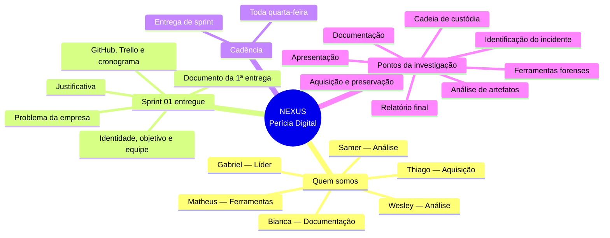

# Cronograma Nexus

**Regra fixa:** toda **quarta-feira** tem entrega de sprint.

O mapa interativo está em [`cronograma-mapa-mental.html`](cronograma-mapa-mental.html) e no GitHub Pages:
https://gabriellucasalves.github.io/Nexus-interprise/cronograma-mapa-mental.html

Como usar:

1. A Sprint 01 já está à esquerda, com todos os tópicos **entregues**.
2. Nas próximas quartas, use **Abrir à esquerda** para trabalhar a sprint.
3. Escreva o texto e os tópicos.
4. Marque o status: **a fazer** (amarelo), **em desenvolvimento** (azul) ou **entregue** (verde). Todos os tópicos recebem a mesma etiqueta.
5. O andamento detalhado dos pontos da investigação fica no Trello. Aqui eles aparecem só como lembrete da equipe.

## Entregas de quarta-feira (2026.2)

| Data | Sprint | Status |
| --- | --- | --- |
| Já realizada | 01 | Entregue |
| 19/08/2026 | 02 | A fazer — abrir à esquerda quando for trabalhar |
| 26/08/2026 | 03 | A fazer |
| 02/09/2026 | 04 | A fazer |
| 09/09/2026 | 05 | A fazer |
| 16/09/2026 | 06 | A fazer |
| 23/09/2026 | 07 | A fazer |
| 30/09/2026 | 08 | A fazer |
| 07/10/2026 | 09 | A fazer |
| 14/10/2026 | 10 | A fazer |
| 21/10/2026 | 11 | A fazer |
| 28/10/2026 | 12 | A fazer |
| 04/11/2026 | 13 | A fazer |
| 11/11/2026 | 14 | A fazer |
| 18/11/2026 | 15 | A fazer |
| 25/11/2026 | 16 | A fazer |
| 02/12/2026 | 17 | A fazer |
