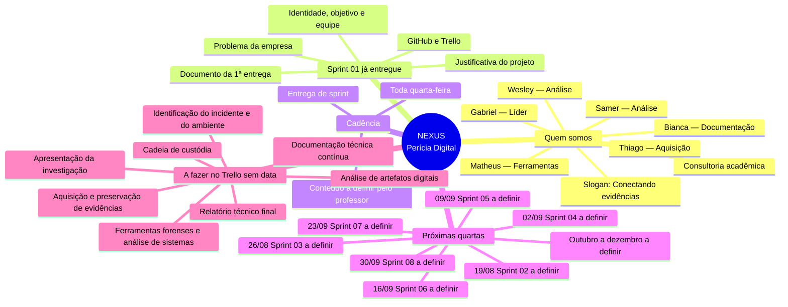

# Cronograma Nexus — mapa mental

**Regra fixa:** toda **quarta-feira** tem entrega de sprint.

As Sprints 02 em diante ainda serão definidas pelo professor. As datas de quarta já estão travadas.

## Cards A fazer (Trello) — sem data definida

Os mesmos cartões da lista **A fazer** do quadro entram no cronograma como atividades previstas. A data só será preenchida quando o professor definir a sprint.

| Atividade | Data | Status |
| --- | --- | --- |
| Identificação do incidente e do ambiente | Sem data | A fazer |
| Aquisição e preservação de evidências | Sem data | A fazer |
| Cadeia de custódia | Sem data | A fazer |
| Análise de artefatos digitais | Sem data | A fazer |
| Ferramentas forenses e análise de sistemas | Sem data | A fazer |
| Documentação técnica contínua | Sem data | A fazer |
| Relatório técnico final | Sem data | A fazer |
| Apresentação da investigação | Sem data | A fazer |

## Entregas de quarta-feira (2026.2)

| Data | Sprint | Status |
| --- | --- | --- |
| Já realizada | 01 | Concluída — problema, justificativa, identidade e equipe |
| 19/08/2026 | 02 | A definir |
| 26/08/2026 | 03 | A definir |
| 02/09/2026 | 04 | A definir |
| 09/09/2026 | 05 | A definir |
| 16/09/2026 | 06 | A definir |
| 23/09/2026 | 07 | A definir |
| 30/09/2026 | 08 | A definir |
| 07/10/2026 | 09 | A definir |
| 14/10/2026 | 10 | A definir |
| 21/10/2026 | 11 | A definir |
| 28/10/2026 | 12 | A definir |
| 04/11/2026 | 13 | A definir |
| 11/11/2026 | 14 | A definir |
| 18/11/2026 | 15 | A definir |
| 25/11/2026 | 16 | A definir |
| 02/12/2026 | 17 | A definir |

O mapa visual para abrir no navegador ou imprimir está em [`cronograma-mapa-mental.html`](cronograma-mapa-mental.html).
